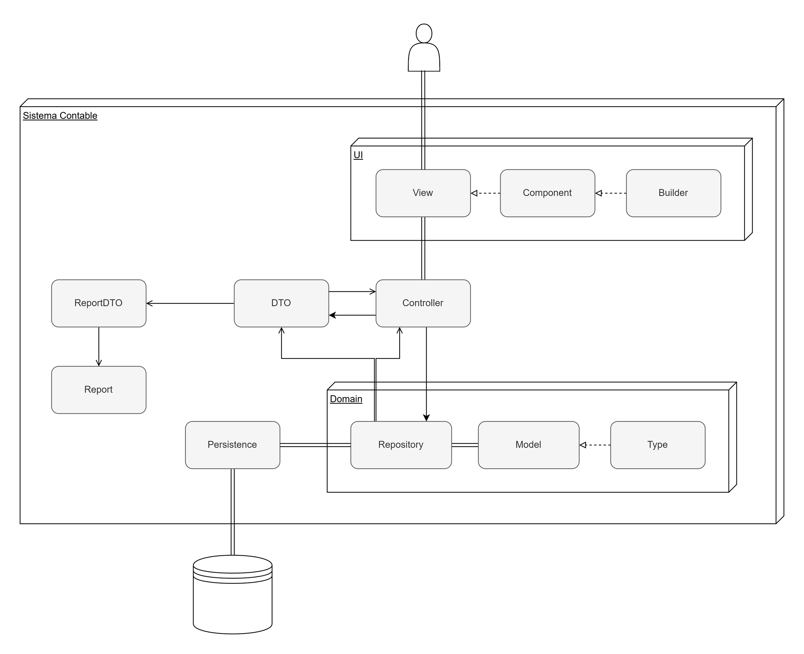
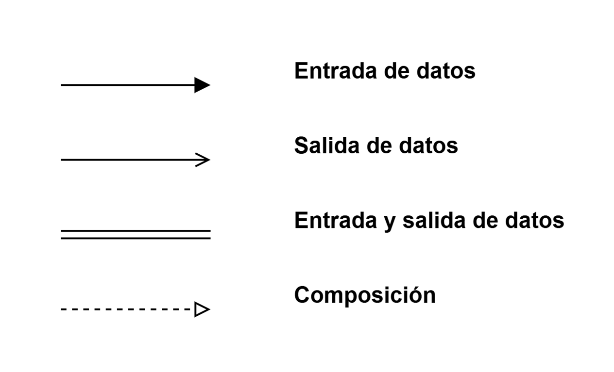
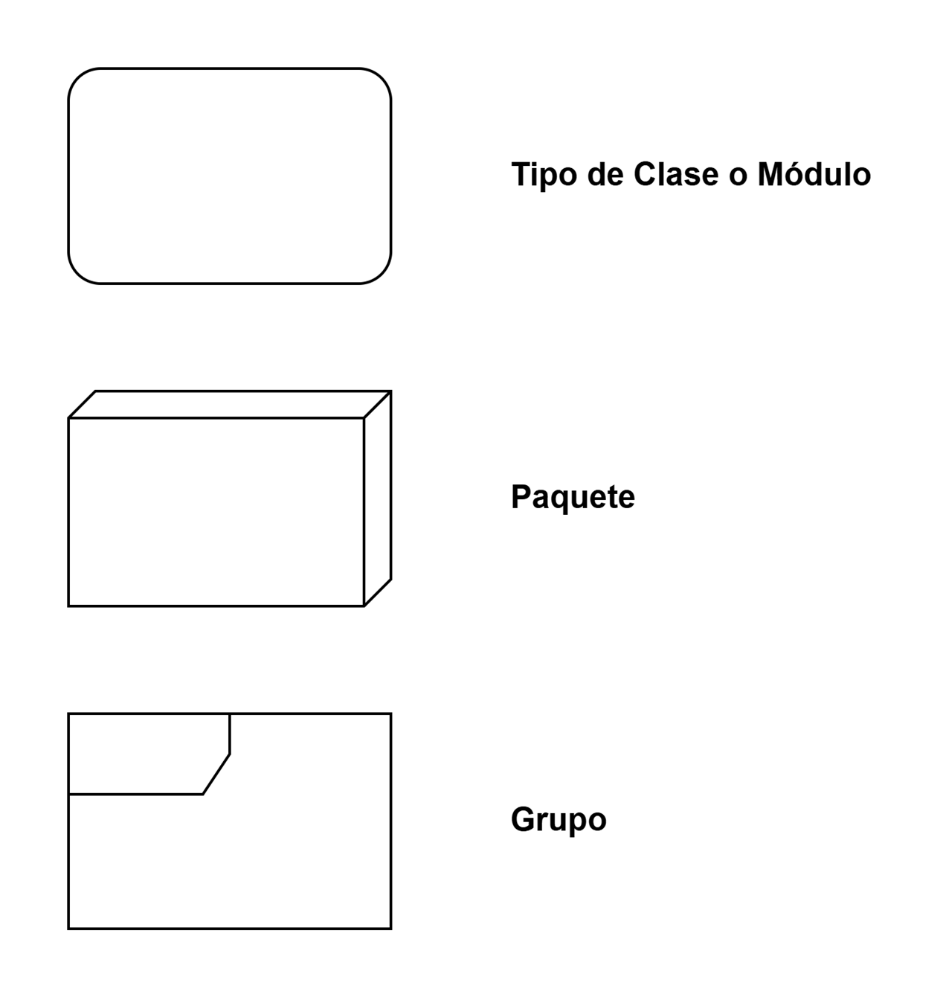
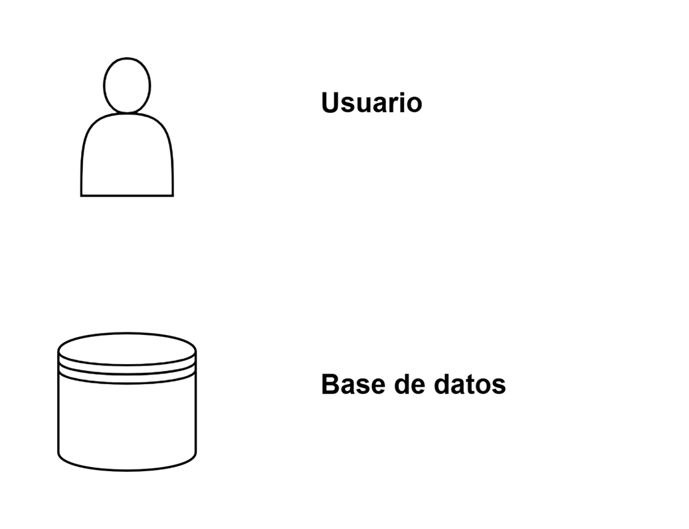
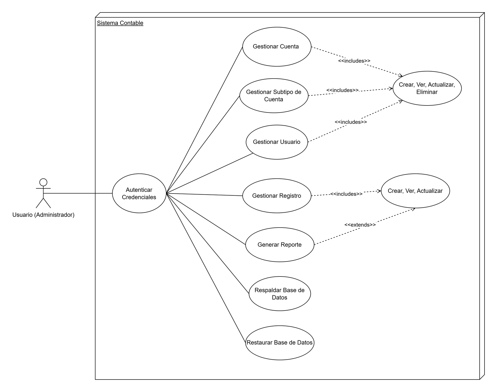
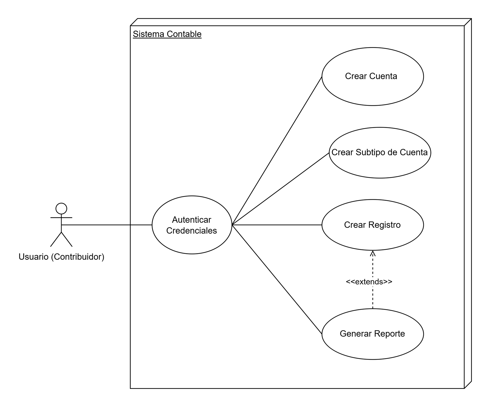
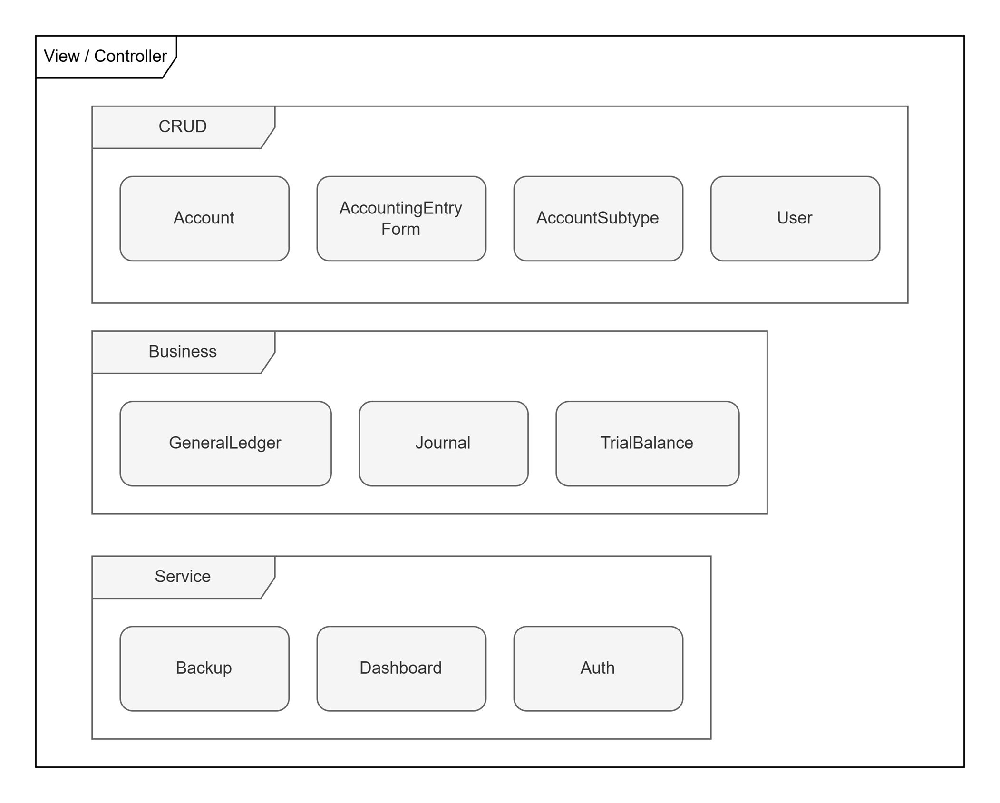
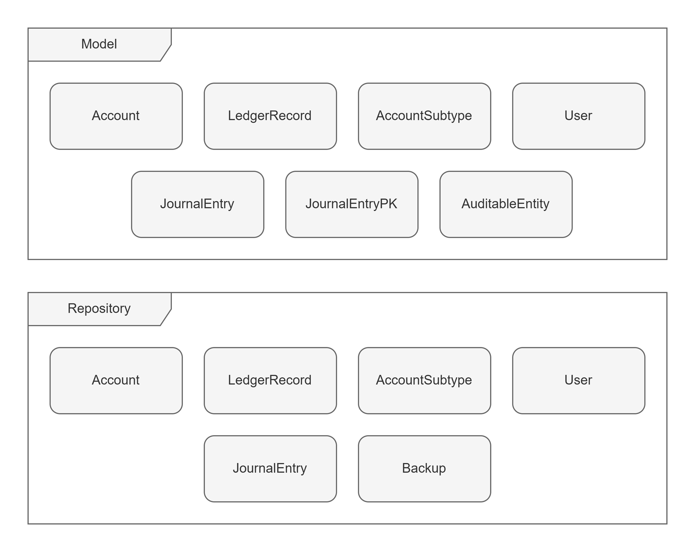
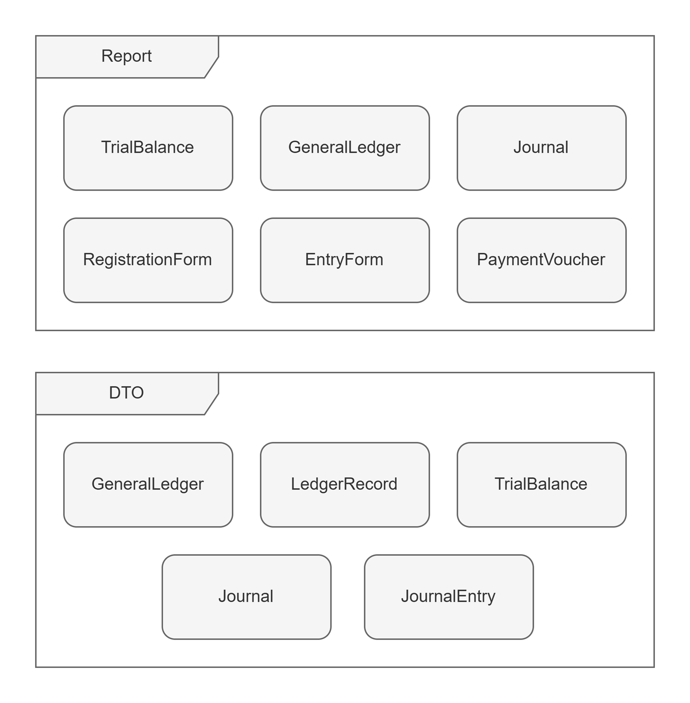

# Sistema Contable

### Propósito

Este es un software de escritorio para la gestión contable de la Fundación Nutre Hogar. Permite el control de registros y cuentas contables, incluyendo la generación de reportes de libro diario, mayor general y balance de comprobación.

### Alcance

- Guarda registros contables como ingresos, egresos y ajustes a través de un formulario de registro
- Genera reportes de los registros contables, al igual que el formulario de registro y su comprobante en formato PDF
- Gestiona las cuentas contables al igual que su categorización
- Almacena datos de manera persistente de manera local
- Facilita el respaldo y restablecimiento de la base de datos
- Permite la administración de usuarios por medio de roles

### Público Objetivo

El software fue diseñado a medida para el personal encargado de contabilidad de la Fundación Nutre Hogar en la localidad de Changuinola, Bocas del Toro.

## Arquitectura del Sistema

El diagrama presentado en la próxima sección demuestra el siguiente flujo con los elementos que conforman el sistema:

- El usuario solicita una View, la cual puede usar (o no) Components que están construidos con Builders.
- La View se comunica con un Controller para llamar una o más funciones de un Repository para consultar los datos requeridos.
- El Repository solicita datos con la estructura de uno o más Models los cuales pueden presentar (o no) un Type en uno de sus atributos.
- El Persistence brinda las configuraciones necesarias para acceder a la base de datos.
- Se retornan los datos y el Repository (dependiendo de su configuración) los pasa a un DTO para darles un formato específico o se envían directamente al Controller para presentarlos posteriormente al Usuario por medio de la View.
- Si en la View se solicita un Reporte, se vuelve a comunicar con el Controller para que el DTO le pase los datos a un ReportDTO y así el Report pueda generar los reportes en PDF.

### Diagrama

### Simbología

Aquí se identifican los elementos que aparecen en los diagramas mostrados en esta documentación, para una mayor comprensión.

#### Conectores

#### Contenedores

#### Otros

## Casos de Uso

Los casos de uso del sistema están divididos en los roles que pueden adquirir los usuarios al momento de su registro.

### Administrador

Pueden utilizar todas las funcionalidades de lectura y escritura de datos al igual que su exportación.

### Auditor

Pueden realizar solamente las operaciones de lectura y exportación de datos.

### Contribuidor

Pueden realizar operaciones de lectura y exportación de datos (generación de reportes solamente), pero la escritura es limitada (no pueden editar registros existentes).

## Tecnologías utilizadas

### Desarrollo

- Java (JDK 21 o 25) para la compilación del código fuente
- NetBeans 21 o mayor, para el diseño de vistas de tipo Java Swing
- IntelliJ IDEA o Visual Studio Code (con el Extension Pack for Java), para programar y compilar el software
- JasperSoft Studio 7.0.3 Community Edition para el diseño de reportes (JasperReports)
- WiX Toolset 3.14.1.8722 para crear el instalador

### Dependencias

- **Hibernate Core:** realiza el mapeo objeto-relacional (ORM) que facilita la interacción entre una base de datos y objetos Java.
- **SQLite JDBC:** el driver JDBC (Java Database Connectivity) para conectarse a la base de datos SQLite.
- **SQLite Dialect:** permite a Hibernate reconocer SQLite como un motor de base de datos compatible.
- **JasperReports:** genera informes dinámicos en varios formatos (PDF, HTML, CSV, etc.) a partir de datos en Java
- **Lombok:** reduce el código repetitivo al generar automáticamente código como getters, setters, constructores y otros métodos comunes en las clases Java.
- **JetBrains Annotations:** añade anotaciones de ayuda que pueden mejorar la calidad del código al proporcionar indicadores adicionales sobre cómo debe usarse cada método o variable.
- **FlatLaf:** estilo para las interfaces gráficas desarrolladas en Java Swing.
- **jBCrypt:** biblioteca de hashing de contraseñas que implementa el algoritmo BCrypt, diseñado específicamente para el almacenamiento seguro de contraseñas.
- **JUnit:** Permite ejecutar métodos de prueba con anotaciones, verificar resultados esperados y automatizar la validación del código.
- **Mockito:** Crea objetos simulados que reemplazan dependencias reales, permitiendo probar clases de forma aislada.

## Estructura del Código (src)

### Organización de Carpetas

El sistema al ser desarrollado Java y al utilizar Maven para la gestión del código fuente, se encuentra estructurado con los siguientes paquetes con sus respectivas clases:

- **applicaction:** Clases que cargan las configuraciones iniciales necesarias para la ejecución del programa.
- **base:** Clases abstractas o interfaces que son heredadas por clases de otros paquetes (domain, controller, report, ui), para la evitar la repetición de código al ejecutar funciones similares en distintas clases.
- **controller:** Clases que funcionan como intermediarios entre las vistas y los datos. Deciden como procesar las solicitudes realizadas por el usuario.
- **domain:** Contiene las clases de modelos y tipos que le indican a Java como se estructura la base de datos, al igual que los repositorios que contienen funciones para hacer consultas a la base de datos.
- **excepcion:** Clases que clasifican los errores dependiendo del paquete para su captura posteriormente.
- **persistence:** Clases que gestionan configuración de la base de datos (utilidades de Hibernate ORM, las sesiones de conexión y la gestión de transacciones).
- **report:** Clases que le indican a Java las plantillas (jrxml) para hacer reportes y como enviarle los datos.
- **ui:** Contiene clases de componentes personalizados, para construir esos componentes y las vistas mostradas en el programa.

### Módulos Principales

El sistema extiende el patrón de arquitectura MVC (Modelo-Vista-Controlador) con la incorporación de repositorios. A continuación, se muestra que contienen estos módulos:

#### Paquetes UI.View y Controller

Las vistas se encargan de presentar los datos de manera visual y los controladores de gestionar su interacción con los datos. Estos paquetes se encuentran organizados en tres subpaquetes

- **CRUD:** Tratan directamente con los modelos, es decir, la lectura, creación, actualización y eliminación de registros en la base de datos.
- **Business:** Consultan datos correspondientes a los registros contable para ser mostrados dentro del sistema o exportarlos en PDF.
- **Service:** Realizan funciones secundarias del sistema como la autenticación del usuario, respaldo de datos o la presentación de las vistas.

#### Paquetes Model y Repository

Los modelos contienen representaciones de entidades de la base de datos y los repositorios las operaciones realizables con ellas.

#### Paquetes Report y Report.DTO

Los reportes permiten la preparación de los reportes con los datos que les son transferidos por sus DTOs.

