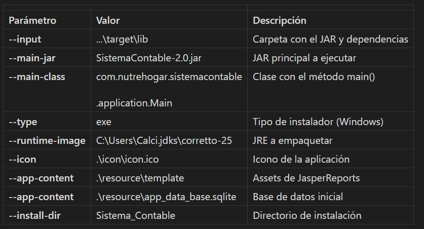

# Compilación del ejecutable
El sistema utiliza `jpackage` (herramienta incluida en el JDK) para crear un instalador nativo de Windows (.exe) que incluye un JRE empaquetado, eliminando la necesidad de que el usuario tenga Java instalado.

## Requisitos previos
* **JDK 21**: Para compilar el código fuente del proyecto
* **JDK 25**: Para empaquetar la aplicación con soporte de caché AOT (Ahead-Of-Time)
* **Maven**: Para gestión de dependencias y construcción del proyecto
* **PowerShell**: Para ejecutar los scripts de empaquetado

## Proceso de compilación
### Paso 1: Compilación del proyecto con Maven
Compilar el proyecto usando maven, en [pom.xml](./../pom.xml) hay un plugin que agrega las dependencias en la carpeta [lib](./../target/lib).

Este genera:
* `/target/SistemaContable-2.0.jar`: El archivo JAR principal del proyecto
* `/target/lib/`: Carpeta con todas las dependencias necesarias (Hibernate, SQLite, JasperReports, etc.)

### Paso 2: Preparación de archivos
Mover el JAR principal a la carpeta de dependencias: `SistemaContable-2.0.jar` -> `lib/`

### Paso 3: Generación del caché AOT (opcional pero recomendado)
El caché AOT (Ahead-Of-Time) mejora significativamente el tiempo de inicio de la aplicación. Se genera en dos pasos:

#### 3.1. Crear ejecutable que genera el caché:

Ejecutar el script [jpackage-create-cache.ps1](./jpackage-create-cache.ps1) desde la carpeta de scripts:

```bash
 cd package
. jpackage-create-cache.ps1
```
Este script crea un instalador con el parámetro `-XX:AOTCacheOutput=cache.aot` que, al ejecutarse, generará el archivo de caché.

#### 3.2. Instalar y ejecutar la versión de generación de caché:

* Instalar el ejecutable generado, la dirección debe de `C:/Users/[usuario]/Sistema_Contable`
* Ejecutar la aplicación al menos una vez, intentar usar todas las funcionales para que el cache sea efectivo
* Localizar el archivo `cache.aot` generado en el directorio de instalación (`Sistema_Contable`)
* Copiar `cache.aot` y guárdelo en una carpeta distinta
* Desinstala el programa

### Paso 4: Generación del instalador final
Ejecutar el script [jpackage.ps1](./jpackage.ps1) para crear el instalador que utiliza el caché:

* Instalar el ejecutable generado, la dirección debe de `C:/Users/[usuario]/Sistema_Contable`
* Mover el archivo `cache.aot` generado al directorio de instalación (`Sistema_Contable`)

## Configuración de jpackage
Ambos scripts utilizan los siguientes parámetros críticos:



Diferencia entre scripts:

`jpackage-create-cache.ps1`: Usa `--java-options` "`-XX:AOTCacheOutput=cache.aot`" para generar el caché

`jpackage.ps1`: Usa `--java-options` "`-XX:AOTCache=cache.aot`" para utilizar el caché existente
Archivos incluidos en el instalador

El instalador empaqueta los siguientes recursos adicionales:

1. Carpeta [template](./resource/template) (assets de JasperReports)

Estas imágenes son referenciadas por las plantillas JRXML para generar reportes PDF.

2. Base de datos inicial [app_data_base.sqlite](./resource/app_data_base.sqlite)

Contiene el esquema de base de datos y datos iniciales necesarios:

* Usuario administrador por defecto
* Catálogo de cuentas contables básico
* Configuración inicial del sistema

Ubicación de archivos después de la instalación
Una vez instalado, el sistema crea la siguiente estructura en el directorio del usuario, `C:/Users/[usuario]/Sistema_Contable/`:

* `Sistema Contable.exe`: Ejecutable principal
* `app/`: archivos de la aplicación
* `runtime/`: JRE
* `logs/`: donde se guardan los logs
* `backup/`: donde se guardan las copias de seguridad
* `template/`: Assets de reportes, ejm: logo.png
* `app_data_base.sqlite`: Base de datos (si es primera instalación)
* `cache.aot`: Caché AOT (si se generó)

### Notas importantes

Versiones de Java: El proyecto debe compilarse con JDK 21 pero se empaqueta con JDK 25 para aprovechar las optimizaciones de caché AOT disponibles en versiones más recientes.
Actualización de dependencias: Si se actualizan las dependencias en [pom.xml](./../pom.xml), es necesario:

* Recompilar con mvn clean package
* Regenerar el caché AOT ejecutando la versión de creación de caché
* Crear un nuevo instalador

**Ruta del JRE**: La ruta `--runtime-image` debe ajustarse según la ubicación del JDK 25 en el sistema del desarrollador que empaqueta la aplicación.

**Tamaño del instalador**: El instalador resultante incluye el JRE completo, lo que aumenta su tamaño (~100-150 MB), pero garantiza que funcionará en cualquier sistema Windows sin requerir Java instalado.

**Compatibilidad**: El instalador generado es compatible con Windows 10 y versiones superiores, según los requisitos mínimos del sistema especificados en la sección 3.1.